# Trinker — Architecture & Engineering Thesis

> Deterministic application security testing for HTTP APIs.
> This document is the technical reference for the `trinker` monorepo. It is
> written to be read top-to-bottom as a thesis on *why* the system is shaped the
> way it is, not merely *what* it does. Every claim here is grounded in the
> source tree as of `main@c8e68bd` (v0.1.1, 2026-09-30), and the suite was run
> green (474 tests, 29 files) while writing it. `docs/SESSION_HANDOFF.md` is
> dated 2026-09-11 and some of its "gaps" have since shipped. Where it disagrees
> with the code, **this document and the code win**.

---

## Table of Contents

1. [System Thesis](#1-system-thesis)
2. [Quick Start](#2-quick-start)
3. [Compile Once, Replay Forever](#3-compile-once-replay-forever)
4. [Repository Layout](#4-repository-layout)
5. [Technology Stack](#5-technology-stack)
6. [The Files: Plan, Runtime, Baseline](#6-the-files-plan-runtime-baseline)
7. [Subsystem: Surface Discovery](#7-subsystem-surface-discovery)
8. [Subsystem: Deterministic Compilation](#8-subsystem-deterministic-compilation)
9. [Subsystem: The Runner](#9-subsystem-the-runner)
10. [Subsystem: The Oracles](#10-subsystem-the-oracles)
11. [Outcomes, Exit Codes & the Baseline](#11-outcomes-exit-codes--the-baseline)
12. [The Event Stream](#12-the-event-stream)
13. [Findings, Evidence & Replay](#13-findings-evidence--replay)
14. [Coverage & Reports](#14-coverage--reports)
15. [Subsystem: The LLM Compiler](#15-subsystem-the-llm-compiler)
16. [The Console](#16-the-console)
17. [Running Trinker Inside Your Test Suite](#17-running-trinker-inside-your-test-suite)
18. [The Safety Model](#18-the-safety-model)
19. [The Juice Shop Evaluation](#19-the-juice-shop-evaluation)
20. [Design Trade-offs & Alternatives Considered](#20-design-trade-offs--alternatives-considered)
21. [Testing & CI](#21-testing--ci)
22. [Limitations & Roadmap](#22-limitations--roadmap)

---

## 1. System Thesis

Trinker compiles application-specific security knowledge into a reviewable,
secret-free `.trinker/plan.json`, then replays that plan on every scan with
**zero runtime LLM tokens**.

The single most important architectural decision is this:

> **Security knowledge is expensive to derive and cheap to replay.** Working out
> that "only the owner of order 42 may read order 42" takes judgement.
> *Checking* it is two requests and a byte comparison. So the expensive step is
> a **compilation** that produces a durable, diffable artifact, and the cheap
> step is a **scan** you can run on every pull request.

Everything else follows from keeping those two phases apart:

- **Reproducibility.** The same plan against the same target gives the same
  result. A confirmed finding is a replayable mechanical fact, and the command
  that replays it is printed in the report.
- **Reviewability.** The plan is committed. Security assumptions become code
  review, not reasoning that vanished when a session ended.
- **Cost.** After compilation, a scan is free.
- **Auditability.** Every finding carries the redacted request/response
  witnesses that produced it.
- **Bounded blast radius.** The runner does only what the plan says. An agent
  that improvises at scan time cannot have its blast radius bounded statically.

| | Agentic pentester | Trinker |
|---|---|---|
| Per-run cost | tokens every run | zero |
| Reproducibility | re-runs differ | same plan, same result |
| Reviewability | reasoning is ephemeral | committed, diffable plan |
| Evidence | model narrative | redacted witnesses + sha256 digests |
| CI | slow, flaky, expensive | fast, exit-code driven |
| Knowledge | re-derived every run | derived once, replayed |

A model may help *author* a plan (`compile --llm`, §15). It never takes part in
*executing* one, and the dependency graph enforces that, not convention.

---

## 2. Quick Start

```bash
npm install -g trinker      # or: npx trinker <command>

cd path/to/your/authorized-target
trinker init                # writes .trinker/runtime.json (holds credentials)
# init does not touch your .gitignore. Keep local state out of git yourself:
printf '%s\n' .trinker/runtime.json .trinker/latest-report.json .trinker/proposal.json .trinker/reports/ >> .gitignore
trinker compile             # extracts routes into .trinker/plan.json
# or, when the surface is not recoverable from source:
trinker compile --openapi openapi.yaml    # JSON or YAML
trinker compile --har traffic.har         # traffic recorded in a browser or proxy
# Author identities, fixtures, invariants and checks: docs/PLAN_AUTHORING.md
# (or have a model propose them: trinker compile --llm, see docs/LLM_COMPILER.md)
trinker run --ci --format sarif
```

`trinker compile` writes **no checks**. It will not invent an authorization
rule, so a plan tests nothing until someone authors one. That is the design,
not a gap.

To see the whole loop against a real vulnerable application in about a minute,
start with the [Juice Shop example](examples/juice-shop/README.md) (§19).

> Trinker is for systems you own or are explicitly authorized to test. Only
> loopback is reachable by default (§18).

---

## 3. Compile Once, Replay Forever

### 3.1 High-level architecture

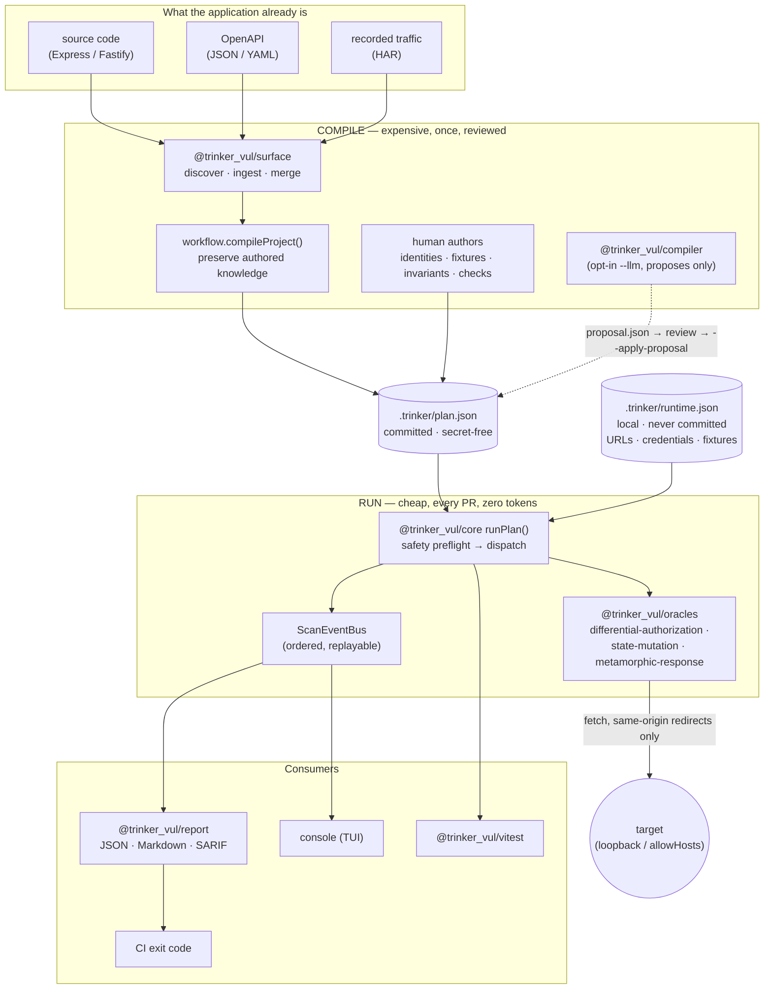

**Reading the diagram.** The left half runs rarely and produces one reviewed
file. The right half runs on every pull request and reads that file plus a local
runtime config. The two halves share only `plan.json`. The model lives
entirely on the left, behind a flag, and can only produce a *proposal* that a
human applies.

### 3.2 The lifecycle

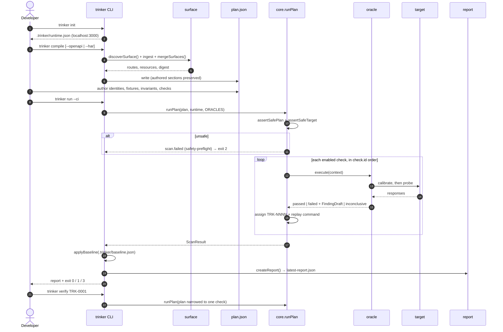

---

## 4. Repository Layout

A pnpm workspace of TypeScript ESM packages behind one `trinker` CLI.

```
trinker/
├── README.md                    ← this document
├── docs/
│   ├── ARCHITECTURE.md          ← packages, execution flow, outcome taxonomy, safety
│   ├── PLAN_AUTHORING.md        ← how to write each kind of check
│   ├── LLM_COMPILER.md          ← compile --llm, providers, key setup, boundaries
│   └── SESSION_HANDOFF.md       ← dated status snapshot (2026-09-11)
├── examples/juice-shop/         ← end-to-end target: compose file, plan, setup.sh
├── .github/workflows/ci.yml     ← typecheck · lint · test · build · Juice Shop E2E
├── eslint.config.js / tsconfig.base.json / vitest.config.ts
│
└── packages/
    ├── core/        @trinker_vul/core      ← schemas, safety, bindings, runner, HTTP client,
    │                                          events, findings, baseline, coverage (zod only)
    ├── surface/     @trinker_vul/surface   ← TS-AST route extraction, OpenAPI + HAR ingest, merge
    ├── oracles/     @trinker_vul/oracles   ← the three deterministic oracles
    ├── report/      @trinker_vul/report    ← JSON / Markdown / SARIF, trust summary
    ├── compiler/    @trinker_vul/compiler  ← the LLM boundary: prompt, context, budget,
    │                                          proposal contract, OpenAI + Anthropic providers
    ├── vitest/      @trinker_vul/vitest    ← assertions + matchers for your own suite
    └── trinker/     trinker (the CLI)
        └── src/
            ├── cli.ts               ← argument parsing, exit codes
            ├── workflow.ts          ← every project operation (compile, run, verify, accept, …)
            ├── scan-view.ts         ← pure reducer: event stream → view model
            └── tui/                 ← console: app, chrome, screens, render, theme
```

**Dependency direction** (enforced by `packages/core/test/architecture.test.ts`):

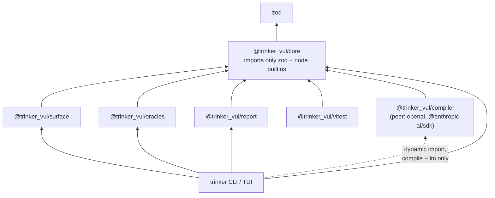

Dependencies point inward. Core knows nothing about the terminal, the
`.trinker/` layout or the CLI, and every security decision lives in core or an
oracle. **No scan-path package depends on the compiler**, and the CLI reaches it
only through `await import(...)` on the `compile --llm` path. A scan therefore
never loads a model client. The architecture test fails if a static import
appears or a scan-path package gains a provider dependency.

---

## 5. Technology Stack

| Concern | Choice | Why |
|---|---|---|
| Language / modules | **TypeScript 5.8, ESM** | One type system from schema to screen. |
| Runtime | **Node ≥ 20** | Native `fetch`, `AbortSignal.timeout`, `performance`. |
| Contracts | **Zod 3** (`.strict()` everywhere) | Plan, runtime config, findings, baseline and LLM proposals are all validated, and unknown keys are errors. |
| Route extraction | **TypeScript compiler API** | Real AST, so receivers and mounts can be *resolved*, not pattern-matched. |
| OpenAPI YAML | **`yaml`** (strict: YAML 1.2, unique keys, warnings are errors) | A misread spec would put fake endpoints into a reviewed plan. |
| HTTP | built-in **`fetch`** with `redirect: "manual"` | Lets the runner refuse cross-origin redirects (§9.2). |
| LLM (opt-in) | **`openai`** / **`@anthropic-ai/sdk`** as optional peers | Installed only by people who use `--llm`; scans never download them. |
| Build / test / lint | **pnpm 10.19**, **tsup**, **Vitest 3**, **ESLint 9 + typescript-eslint** | |
| Publishing | `trinker` + `@trinker_vul/*` on npm, MIT | |

---

## 6. The Files: Plan, Runtime, Baseline

```
.trinker/
├── plan.json            commit        the reviewed security artifact
├── baseline.json        commit        reviewed, risk-accepted checks (§11.3)
├── runtime.json         never commit  targets, credentials, fixtures, values, mutation flag
├── proposal.json        don't commit  last LLM proposal awaiting review (§15)
├── latest-report.json   don't commit  last scan (read by verify / accept / report / coverage)
└── reports/             don't commit  exported reports (evidence can contain response data)
```

`trinker init` does **not** edit your `.gitignore`. Add the last four entries
yourself (see §2). This repository's own `.gitignore` does it with unanchored
`**/.trinker/…` patterns, which is a good template.

The split between the first and third file is the core of the safety model.
**`plan.json` refers to everything sensitive by key only.** It holds no target
URL, no credentials, and no inline credential-like value: `PlanSchema` rejects
any non-empty value under a key matching
`authorization|cookie|password|secret|api_key|access_token|refresh_token`
unless it is a `runtimeRef` / `fixtureRef`.

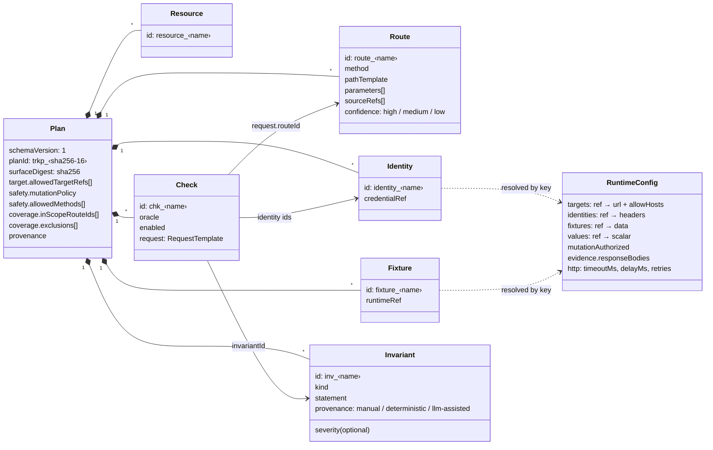

`PlanSchema.superRefine` checks referential integrity. Every check's route,
invariant and identities must exist, and so must a state-mutation check's
`readRequest` route.

**Value bindings.** A request template fills path, query and header slots from
one of three sources:

| Binding | Resolves from | In evidence |
|---|---|---|
| `{ "fixtureRef": "fixture_x", "field": "id" }` | `runtime.fixtures` | **shown**, because a finding about object 42 is unreadable if 42 is hidden |
| `{ "runtimeRef": "key" }` | `runtime.values` | **masked** everywhere it is recorded |
| `{ "literal": "…" }` | the plan | shown |

A missing reference raises `BindingResolutionError`. The check is then reported
`errored` with an actionable message ("Add it to `values` in
`.trinker/runtime.json`"), never `inconclusive`.

Full authoring guide: [`docs/PLAN_AUTHORING.md`](docs/PLAN_AUTHORING.md).

---

## 7. Subsystem: Surface Discovery

`@trinker_vul/surface` turns what the application already is into routes. It has
three inputs that merge into one surface.

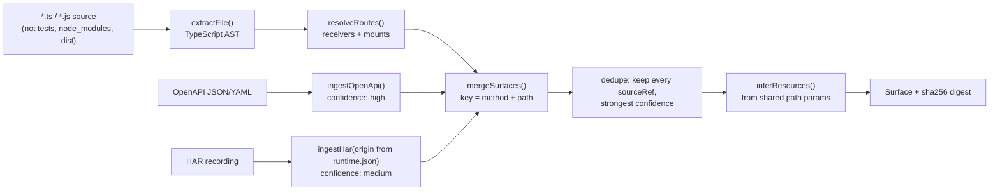

**Extraction resolves the receiver before believing a call.** `cache.get('/x')`
is not a route. Receivers are traced back to `express()`, `express.Router()`,
`Fastify()` or a Fastify plugin's instance parameter. Mount prefixes
(`app.use('/api/orders', router)`, `fastify.register(plugin, { prefix })`)
resolve **within and across files**, following relative imports, and chained
`.route('/x').get().post()` walks the whole chain.

| `confidence` | meaning |
|---|---|
| `high` | receiver proven by a framework factory call, path fully resolved; or declared in OpenAPI |
| `medium` | receiver matched only by naming convention, several mounts, cross-file mount, or observed in HAR traffic |
| `low` | router never mounted in the analysed sources, so the path is probably incomplete |

**An unrecognised receiver produces no route at all.** A missing endpoint is
recoverable, because you can add it by OpenAPI, HAR or hand. A fabricated one
silently corrupts a reviewed plan.

**HAR ingestion** keeps only requests to the plan's own target origin, which
comes from `runtime.json` and not from the recording. A HAR full of third-party
calls therefore cannot put someone else's API into the plan. Value-like path
segments become parameters (`/api/orders/42` → `/api/orders/:id`). Preflights
and HEADs are ignored.

---

## 8. Subsystem: Deterministic Compilation

`trinker compile` (`workflow.compileProject`) writes the plan. It **never
invents an authorization claim**: identities, fixtures, invariants and checks
start empty, and the safety policy starts at its most conservative
(`mutationPolicy: "forbid"`, `GET`/`HEAD`/`OPTIONS` only).

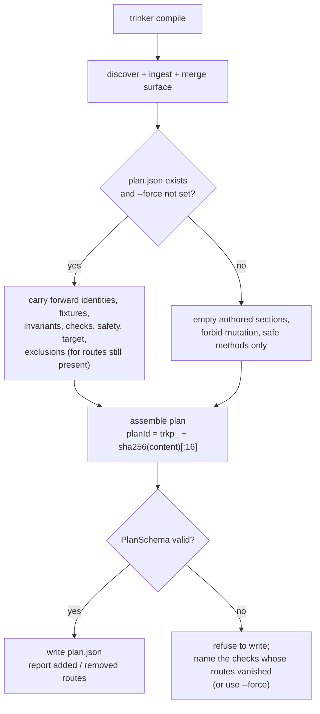

**Recompiling preserves human work.** It replaces only what is derived from
source. If the result would not validate, typically because a check references
a route that no longer exists, compile **refuses to write** and names the
offending checks rather than silently discarding reviewed security knowledge.
`--force` regenerates from scratch.

**The plan ID is content-addressed**, so any change to the plan changes its ID.
The LLM compiler relies on this to refuse a stale proposal (§15).

---

## 9. Subsystem: The Runner

### 9.1 `runPlan`

`@trinker_vul/core`'s `runPlan` is the whole execution engine. It is small on
purpose.

1. Emit `scan.started` (with `runtimeTokens: 0`).
2. **Safety preflight**: `assertSafePlan` + `assertSafeTarget` (§18). On failure
   it emits `scan.failed { phase: "safety-preflight" }` and aborts **before any
   request**.
3. Run enabled checks **in `check.id` order** (deterministic), dispatching each
   to the oracle registered under its `oracle` name.
4. Classify each outcome (§11). An oracle that reports `failed` *without*
   evidence is downgraded to `errored`, because a failure without mechanical
   evidence is not a finding.
5. For a confirmed finding, the runner **assigns the ID** (`TRK-0001`, …) and
   therefore **the replay command** (`trinker verify TRK-0001`). An oracle
   returns a `FindingDraft` with neither, so the two cannot desynchronise.
6. Apply the invariant's `severity` (default `high`) and, if
   `evidence.responseBodies` is `false`, drop every body preview.
7. Emit `scan.completed` with counts and `untested`.

`--target <ref>` scans another entry of `allowedTargetRefs`. It only reorders
refs the committed plan already allows, so the flag cannot widen scope.

### 9.2 The HTTP client

`FetchHttpClient` is the runner's only network surface:

| Behaviour | Default | Why |
|---|---|---|
| Timeout | 15 s (`http.timeoutMs`) | |
| **Redirects** | followed **only within the original origin**, max 5 | `fetch` would follow a 30x to any host and walk a scan past the allowlist. A cross-origin redirect is returned to the oracle as the 30x it is. |
| Retries | 0, max 5 (`http.retries`) | **Safe methods only, network errors only.** A write is never re-sent, and an HTTP status is an answer, not a failure. |
| Throttle | 0 ms (`http.delayMs`) | Minimum gap between requests, to stay under a target's rate limit. |

303 responses, and 301/302 after a non-GET, become a body-less GET, as browsers
do.

---

## 10. Subsystem: The Oracles

An oracle confirms a finding only when it observes specific, mechanical
evidence. **Each one calibrates before it judges**, and anything unexplained is
`inconclusive`, never a finding.

| Oracle | Confirms | Evidence required |
|---|---|---|
| `differential-authorization` | Broken Object Level Authorization (BOLA) | a denied identity received a response matching an allowed identity's witness on **both** status and full-body sha256 |
| `state-mutation` | Unauthorized State Mutation | a protected path's value **changed** after an unauthorized write, having first been proven stable |
| `metamorphic-response` | a response depends on a caller-supplied parameter (client-controlled data scoping) | a variant violated the plan's declared relation, on an endpoint first proven deterministic |

`browser-execution` and `out-of-band` are valid in the schema but have no oracle
yet. A check naming them is reported `unavailable`.

### 10.1 Differential authorization

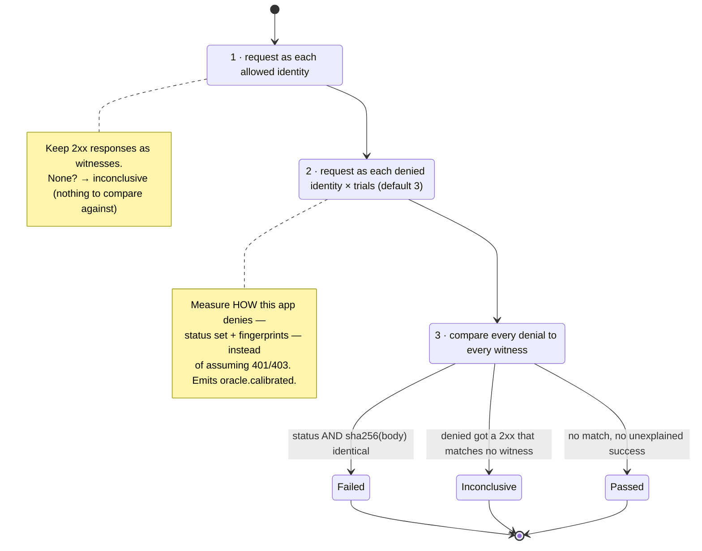

Similarity is never enough, and confirmation requires byte equality. A 2xx that
doesn't match any witness "needs manual review" and is reported `inconclusive`.

### 10.2 State mutation

Reads the state as `readIdentityId` and proves the `protectedPaths` (dotted
paths such as `owner.id` or `items.0.price`) are stable across
`stabilityReads` control reads. It then attempts the write as each unauthorized
identity and reads again. **The evidence is the state, not the write's status
code**: a server that answers 200 and ignores the request has not been
exploited. An unstable value or a 2xx with no change is `inconclusive`.

> A state-mutation check writes to live state and **does not restore it**,
> which is inherent to testing whether a write is possible. The finding says so,
> because a replay against already-mutated state cannot reproduce.

### 10.3 Metamorphic response

Every variant is sent as the **same** identity, and only query parameters
differ. The first variant is repeated to prove the endpoint is deterministic, so
a timestamp or nonce in the body is reported `inconclusive` rather than as a
vulnerability. Then each variant is compared under the declared relation:

- `identical` — status and body digest must match. Use it when a parameter must
  not influence the response at all, such as `?userId=someone-else`.
- `status-identical` — only the status must match.

The oracle never guesses which parameters are security-relevant. The plan
declares the relation, and the oracle only checks it.

---

## 11. Outcomes, Exit Codes & the Baseline

### 11.1 Five outcomes, two of them verdicts

| Status | Meaning | Verdict? |
|---|---|---|
| `passed` | the oracle ran and the invariant held | ✅ |
| `failed` | the oracle ran and mechanically confirmed a violation | ✅ |
| `inconclusive` | the oracle ran but could not reach a verdict | ✗ |
| `errored` | the oracle threw: a bug, a bad binding, an unreachable target | ✗ fault |
| `unavailable` | no oracle is registered for this check | ✗ fault |

There is deliberately **no "skipped"**. "0 findings" must never be readable as
"everything was tested", so every report leads with a trust summary
(**COMPLETE** / **INCOMPLETE**) that lists each check without a verdict.

### 11.2 Exit codes

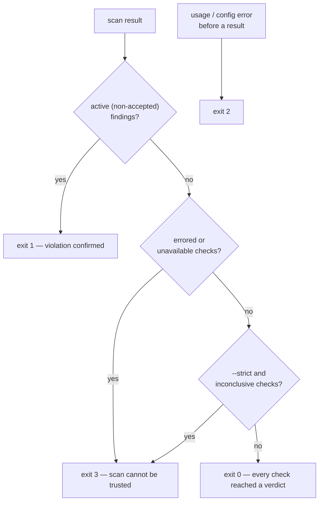

| Code | Meaning |
|---|---|
| 0 | every planned check reached a verdict and none confirmed a violation |
| 1 | a violation was mechanically confirmed and is not accepted in the baseline |
| 2 | usage or configuration error, raised before a scan produced a result |
| 3 | the scan could not be trusted: a check errored or had no oracle (and, with `--strict`, was inconclusive) |

3 is distinct from 1 so a broken pipeline is never mistaken for a vulnerability,
and distinct from 0 so a scan that tested nothing cannot report success.
`trinker verify` always runs strict, because a replay asks a direct question.

### 11.3 The baseline

`trinker accept TRK-0003 --reason "public by design, see ADR-12"` records the
check behind a finding in the **committed** `.trinker/baseline.json`:

- It is keyed by **check**, not finding ID, because IDs are assigned per scan.
- **A reason is required.** An acceptance nobody can explain in review is a
  suppression, not a decision.
- An accepted finding is **still reported**, labelled with its reason. It only
  stops failing the build (exit 1).

---

## 12. The Event Stream

`ScanEventBus` (core) emits ordered envelopes:
`{ version: 1, scanId, sequence, timestamp, type, data }`.

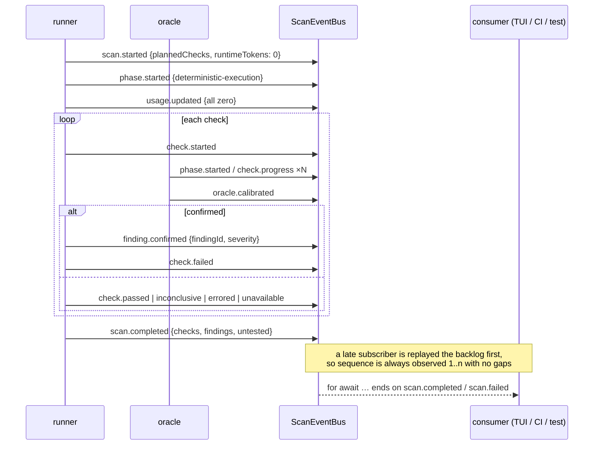

The bus **retains its history** and replays it to any listener that attaches
later, so the runner is free to emit before any consumer exists. Async iteration
terminates on `scan.completed` or `scan.failed`, and a safety refusal emits
`scan.failed` rather than leaving consumers waiting. The console reduces this
stream with a pure function (`scan-view.ts`), tested without a terminal, and CI
consumes the same stream.

---

## 13. Findings, Evidence & Replay

Every finding carries: route, invariant statement, oracle verdict, **redacted
witness requests and responses with sha256 body digests**, remediation, and a
replay command that matches its own ID.

**Redaction.** Headers matching
`authorization|cookie|token|secret|api_key|password` are replaced with
`[REDACTED]`. Every `runtimeRef` value is masked wherever it appears in a URL,
header or body, in raw and URL-encoded form. Body previews are capped at 1000
characters, and `evidence.responseBodies: false` drops them entirely for targets
whose responses can carry personal data. The digest is kept either way.

**Replay.** `trinker verify <id>` narrows the plan to the single check behind the
finding and runs it with no LLM. The reproduced finding keeps its original ID,
and the answer is one of three verdicts:

| Verdict | When | Exit |
|---|---|---|
| `reproduced` | the check confirmed again | 1 |
| `not-reproduced` | the check now **passes** | 0 |
| `untestable` | the check could not reach a verdict (e.g. state already mutated) | 3 |

"Did not reproduce" is only claimed when the check actually passed. A replay
that could not conclude is never reported as though the flaw were gone.

---

## 14. Coverage & Reports

**Two coverage numbers, deliberately different:**

- **Planned coverage**: routes with an enabled check, divided by in-scope
  routes. This is what the plan *intends* to test.
- **Verified coverage**: routes where **every** planned check reached a verdict
  in the last scan. One unavailable oracle makes a route unverified, because a
  partially tested route cannot support a claim that it is clean. Unverified
  routes are attributed to their cause (inconclusive, errored, unavailable).

```bash
trinker coverage          # human-readable
trinker coverage --ci     # JSON
```

**Reports** (`@trinker_vul/report`) are built from the same `SecurityReport`
(`{ generatedAt, plan, result, coverage }`):

| Format | Use |
|---|---|
| `json` | machine consumption; also stored as `.trinker/latest-report.json` |
| `markdown` | humans, PR comments |
| `sarif` | code-scanning dashboards. Checks without a verdict are emitted **as results too**, so a dashboard cannot show green for a scan that executed nothing. |

`trinker run --ci --format <fmt>` prints to stdout. `trinker report
--json|--sarif|--markdown` exports the latest scan to `.trinker/reports/`.

---

## 15. Subsystem: The LLM Compiler

`trinker compile --llm` asks a model **what should be tested**, then validates
every suggestion deterministically before it can enter a plan. It never asks a
model what is *vulnerable*. Full reference:
[`docs/LLM_COMPILER.md`](docs/LLM_COMPILER.md).

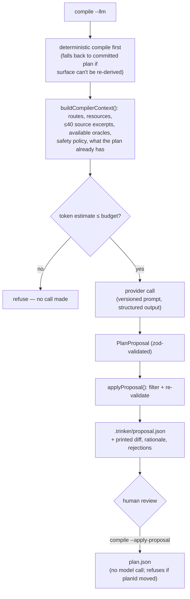

**What the model is given:** routes, inferred resources, narrow source windows
around route declarations, the oracles that actually exist, the safety policy,
and the plan's current contents. **What it is not given:** runtime config,
credentials, or the target URL. `compileWithProvider` asserts that separately,
because that is the one call that sends data off the machine.

**What `applyProposal` enforces in code** (one bad item is rejected with a
reason; the rest can still merge):

| Rule | Effect |
|---|---|
| additive only | cannot redefine anything a human already reviewed |
| safety is fixed | cannot widen `allowedMethods` or the mutation policy |
| references must resolve | unknown route, identity, fixture or invariant → rejected |
| oracle must exist | a check naming an unimplemented oracle → rejected |
| no credentials | merged plan is re-validated by `PlanSchema` |
| provenance is stamped | invariants are marked `llm-assisted` by Trinker, never by the model |

**Review before write.** `--llm` alone records the proposal and prints what
would change. `--apply-proposal` writes **exactly the reviewed bytes** with no
second model call, re-validates the file, and refuses if `plan.json` has changed
since. (`--llm --apply` exists, but it would apply a *new* model output, not
the one you read.)

| Provider | Key | Default model |
|---|---|---|
| `openai` (default) | `OPENAI_API_KEY` | `gpt-5.6-terra` |
| `anthropic` | `ANTHROPIC_API_KEY` | `claude-opus-5` |

The token budget (`--token-budget`, default 60 000) is enforced **twice**: an
estimate before the call and real usage after it. Every compilation records
provider, model, prompt version (`2026-09-11.1`), tokens, and checks
proposed/accepted/rejected. The API key is read only from the environment and is
stripped from provider error messages. The SDKs are optional peers, so install
one with `npm install openai` (or `@anthropic-ai/sdk`).

**Status.** OpenAI has been run against the real API on Juice Shop. The proposal
validated unchanged, and one of its checks confirmed a real BOLA the hand-written
plan had missed. Anthropic is verified against a local stub of its API but not
yet against the real one.

---

## 16. The Console

Running `trinker` with no arguments in a TTY opens a keyboard-driven console.
It is a presentation layer only: every number comes from the workflow layer and
every scan event comes from the runner's own bus. It makes no security decision
and duplicates no engine logic.

| Menu | What it does |
|---|---|
| Run Security Scan | live progress from the event stream |
| Compile Security Plan | review the recorded proposal; `c` compiles with a model (`TRINKER_PROVIDER` picks the provider) |
| View Latest Report | scrollable report |
| View Findings | list with `/` search; open one for its evidence |
| Verify Finding | replay one finding (`v`) |
| Security Coverage | planned vs verified |
| Export Report | `j` JSON · `s` SARIF · `m` Markdown |
| Configuration | runtime config view; `m` toggles `mutationAuthorized` |

Keys: arrows, PgUp/PgDn, Home/End, `/` search, `?` help, `r` refresh, `q`/Esc
back. Scrolling is clamped to the content, and the console repaints on resize.
The dashboard never shows a placeholder: missing data reads as "no scan yet"
rather than an invented percentage.

---

## 17. Running Trinker Inside Your Test Suite

`@trinker_vul/vitest` exposes plain throwing assertions, which work in Vitest,
Jest or `node:test`:

```ts
import { assertSecure } from "@trinker_vul/vitest";

it("has no authorization flaws", async () => {
  assertSecure(await scan());  // fails on a finding AND on a check that never ran
});
```

`assertSecure` checks **completeness before findings**, because "no findings"
from a scan that executed nothing is the failure this framework exists to
prevent. Also available: `assertNoConfirmedFindings`, `assertScanComplete`,
`assertNoFaults`, `assertFindingIds`, `describeScan`.

Prefer matchers? `import "@trinker_vul/vitest/setup"` registers `toBeSecure`,
`toBeCompleteScan`, `toHaveNoConfirmedFindings` and `toHaveFindingIds` (types
included). For Jest, call `expect.extend(trinkerMatchers)`.

```ts
expect(await scan()).toBeSecure();
```

---

## 18. The Safety Model

All gates are **hard aborts before any HTTP request**, never warnings.

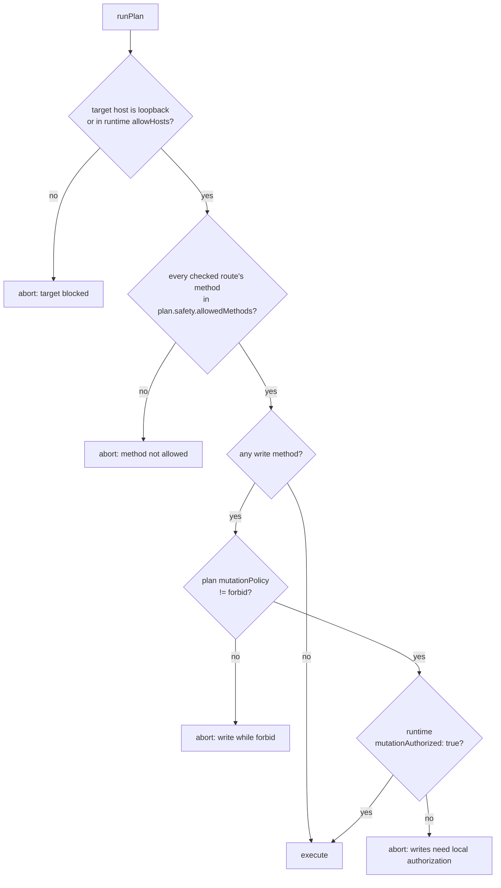

- **Loopback is implicit** (`localhost`, `127.0.0.1`, `::1`). Any other host must
  be named in `allowHosts` in your local, uncommitted `runtime.json`.
- **Writes need two keys**: a plan that permits mutation **and**
  `mutationAuthorized: true` in runtime config. The committed plan alone can
  never authorize a write, which is what keeps a plan safe to merge.
- **Redirects never leave the origin** (§9.2), and **writes are never retried**.
- **`--target` cannot widen scope.** It only picks among refs the plan allows.
- **Credentials never enter a plan, a report, or a model request** (§6, §13, §15).

---

## 19. The Juice Shop Evaluation

[`examples/juice-shop/`](examples/juice-shop/README.md) is the integration
target: a real, intentionally vulnerable application scanned over real HTTP. It
exercises all three oracles, plus one **negative control** per oracle family,
because a scanner that only ever fires is not evidence of anything.

| Check | Oracle | Expectation |
|---|---|---|
| `chk_basket_cross_customer` | differential-authorization | **confirms** — any customer can read another's basket |
| `chk_basket_item_cross_customer_write` | state-mutation | **confirms** — another customer can change your item's quantity |
| `chk_basket_items_scope_tampering` | metamorphic-response | **confirms** — `?BasketId=N` returns whichever basket you name |
| `chk_basket_requires_auth` | differential-authorization | **passes** — anonymous access is refused with 401 |
| `chk_addresses_scope_tampering` | metamorphic-response | **passes** — `?UserId=N` is correctly ignored |

```bash
cd examples/juice-shop
docker compose up -d && ./setup.sh   # logs in two customers, writes runtime.json
trinker run                          # 3 confirmed, 2 passed → exit 1, COMPLETE
trinker verify TRK-0001
```

`setup.sh` derives each customer's **own** basket from their JWT. "First
readable basket" would have been wrong, because reading someone else's basket is
the very flaw under test. Run it against a freshly seeded container: the
state-mutation check leaves the quantity changed, so a second run honestly
reports `inconclusive`. Never point this at a shared or hosted instance.

---

## 20. Design Trade-offs & Alternatives Considered

| Decision | Alternative considered | Why the current design won |
|---|---|---|
| **Compile, then replay** | Reason with a model on every scan | Per-run token cost, non-reproducible results, and a blast radius nobody can bound. |
| **Compile writes no checks** | Infer authorization rules from code | An invented rule is a false claim in a reviewed artifact. Empty is honest. |
| **Plan / runtime split** | One config file | Lets the plan be committed and reviewed while credentials and URLs stay local. |
| **Byte-equality to confirm BOLA** | Status match or body similarity | Similarity scores make findings arguable. A sha256 match is a fact. |
| **Calibrate before judging** | Assume 401/403 means denied | Real apps deny with 200 + error bodies, redirects or 404s. Measure, don't assume. |
| **State, not status, for writes** | Trust a 2xx on the write | A server that answers 200 and ignores the write was not exploited. |
| **No "skipped"; exit 3** | Count untested checks as passing | "0 findings" from a scan that tested nothing is the failure mode this project exists to prevent. |
| **Runner assigns finding IDs** | Oracles name their own findings | Makes "the report tells you to run a command that doesn't exist" unrepresentable. |
| **Unrecognised receiver → no route** | Regex every `.get('/…')` | A missing route is recoverable; a fabricated one corrupts the plan. |
| **Baseline keyed by check, with a reason** | Suppress by finding ID / no reason | IDs change per scan; an unexplained acceptance is a suppression. |
| **LLM proposes, code decides** | Let the model write the plan | Additive-only, safety-fixed, re-validated; human applies the reviewed bytes. |
| **Compiler only via dynamic import** | A normal dependency | Makes "a scan costs zero tokens" a property of the dependency graph, checked by a test. |
| **Same-origin redirects only** | Let `fetch` follow | Otherwise a target could redirect a scan past the allowlist. |
| **Strict YAML** | Lenient parsing | A misread spec puts non-existent endpoints into a security plan. |

---

## 21. Testing & CI

```bash
pnpm install
pnpm test        # vitest across every package
pnpm typecheck
pnpm lint        # ESLint 9 + typescript-eslint
pnpm build       # tsup per package
```

If `pnpm` is not installed, `npx pnpm@10.19.0 <script>` works, as do the
workspace binaries directly (`./node_modules/.bin/vitest run`).

The suite has **474 tests in 29 files**, including:

- `core` — schema (inline-secret rejection, referential integrity), safety
  gates, bindings, the HTTP client (redirects, retries, throttle), event
  ordering and replay, coverage, the runner, and **`architecture.test.ts`**
  (dependency direction and the zero-token rule).
- `surface` — AST extraction, cross-file discovery, HAR ingestion.
- `oracles` — each oracle's confirm, pass and inconclusive paths.
- `compiler` — proposal validation, provider selection, and the **real
  `openai` / `@anthropic-ai/sdk` SDKs against local API stubs**.
- `trinker` — workflow, LLM compile flow, scan-view reducer, TUI render,
  screens and scrolling.
- `vitest` — assertions and matchers.

**CI** (`.github/workflows/ci.yml`, every push to `main` and every PR):

1. **verify** — frozen-lockfile install, typecheck, lint, test, build.
2. **juice-shop** — builds, starts a freshly seeded container, runs `setup.sh`,
   and scans. It requires **exit 1**, then asserts:
   - exactly one finding per oracle, with each replay command matching its ID;
   - both negative controls pass;
   - no check is inconclusive, errored or unavailable;
   - no JWT leaked into the report.

   It then replays the two read-only findings (`TRK-0001`, `TRK-0003`) and
   requires both to reproduce.

---

## 22. Limitations & Roadmap

**In scope today:** object-level authorization (BOLA), unauthorized state
mutation, and client-controlled data scoping, for HTTP APIs.

**Not yet implemented:**

- **`browser-execution` and `out-of-band` oracles.** They are valid in the schema
  and reported `unavailable` (exit 3).
- **A crawler.** Surfaces come from source, OpenAPI, or a HAR you record
  yourself.
- **Route forms** — template-literal paths with substitutions and NestJS
  decorators are not discovered (deliberate, conservative false negatives).
- **RBAC matrices** — `identity.roles` / `capabilities` are stored but nothing
  consumes them yet.
- **State restoration** — state-mutation checks don't clean up after
  themselves. CI sidesteps this with a fresh container.
- **Plan migrations** — `schemaVersion` is `1` with no v2 path yet.
- **Anthropic** has not been verified against its real API.

**Out of scope:** injection (SQL/NoSQL/command), path traversal, CSRF, SSRF,
XXE, deserialization, session and JWT attacks, race conditions and
business-logic abuse.

---

## Appendix A — CLI Reference

| Command | Purpose |
|---|---|
| `trinker` | interactive console (requires a TTY) |
| `trinker init` | create `.trinker/runtime.json` |
| `trinker compile [--force] [--openapi <file>] [--har <file>]` | extract routes into `plan.json`, preserving authored content |
| `trinker compile --llm [--provider openai\|anthropic] [--model <id>] [--token-budget <n>] [--apply]` | have a model propose checks (opt-in, costs tokens) |
| `trinker compile --apply-proposal` | apply the recorded proposal; no model call |
| `trinker run [--ci] [--format json\|markdown\|sarif] [--strict] [--target <ref>]` | execute the plan; never contacts a model |
| `trinker verify <finding-id> [--target <ref>]` | replay one finding (1 reproduced, 0 gone, 3 untestable) |
| `trinker accept <finding-id> --reason "<why>"` | record a reviewed risk in `baseline.json` |
| `trinker report [--json\|--sarif\|--markdown]` | export the latest scan |
| `trinker coverage [--ci]` | planned vs verified coverage |

## Appendix B — `runtime.json` Reference

```jsonc
{
  "targets": {
    "local": { "url": "http://localhost:3000", "allowHosts": [] }
  },
  "identities": {
    "owner":  { "headers": { "authorization": "Bearer …" } },
    "other":  { "headers": { "authorization": "Bearer …" } }
  },
  "fixtures": { "ownedOrder": { "id": 42 } },        // shown in evidence
  "values":   { "tenantKey": "…" },                  // masked in evidence
  "mutationAuthorized": false,                       // second key for write checks
  "evidence": { "responseBodies": true },            // false = drop body previews
  "http": { "timeoutMs": 15000, "delayMs": 0, "retries": 0 }
}
```

Environment: `OPENAI_API_KEY` / `ANTHROPIC_API_KEY` (only for `--llm`),
`OPENAI_BASE_URL` / `ANTHROPIC_BASE_URL` (gateway), `TRINKER_PROVIDER` (console
compile).

## Documentation

- [Architecture](docs/ARCHITECTURE.md) — packages, execution flow, outcome taxonomy, safety model
- [Plan authoring](docs/PLAN_AUTHORING.md) — how to write each kind of check
- [LLM compiler](docs/LLM_COMPILER.md) — `compile --llm`, providers, key setup, boundaries
- [Juice Shop evaluation](examples/juice-shop/README.md) — reproducible end-to-end run
- [Session handoff](docs/SESSION_HANDOFF.md) — dated status snapshot

---

*MIT licensed. This document reflects `main@c8e68bd` (v0.1.1). Diagrams are
authored in Mermaid and render natively on GitHub. When the code changes, update
the affected section and its diagram together — a stale diagram is worse than
none.*
